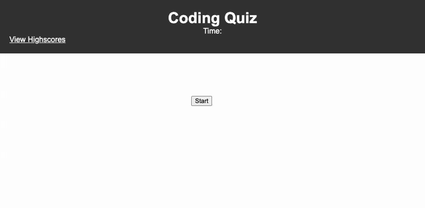

  # Module 4 Challenge

  

  ## Description
  This challenge project creates a timed quiz on JavaScript fundamentals that stores high scores so that I can gauge my progress compared to my peers. This will help to familiarize myself with the coding assessment typically given during an interview process.

  ## Table of Contents 
  - [Installation](#installation)
  - [Usage](#usage)
  - [License](#license)
  - [How to Contribute](#how-to-contribute)
  - [Tests](#tests)
  - [Questions](#questions)

  ## Installation
  N/A

  ## Usage
  

  ## License
  MIT

  ## How to Contribute

  ## Tests
  
  ## Questions
  If you have any questions I can be reached at delantetr@gmail.com.
  Github: https://github.com/delantetr/refactored-eureka
